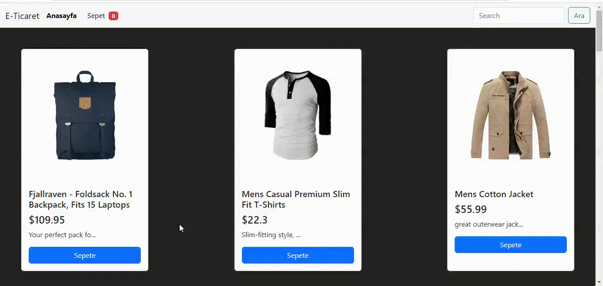

## REDUX THUNK PROJECT

# USED
> Redux - thunk
> Boostrap
> React-router-dom
> useDispatch
> useSelector
> Provider
> ternary operator ( ? :)
> && operator 
> findIndex ()
> concat ()
> createStore, 
> combineReducers, 
> applyMiddleware

# CONTANT

* ilkhukuk@gmail.com
* https://www.linkedin.com/in/ilkhukuk/

# SCREENSHOT

